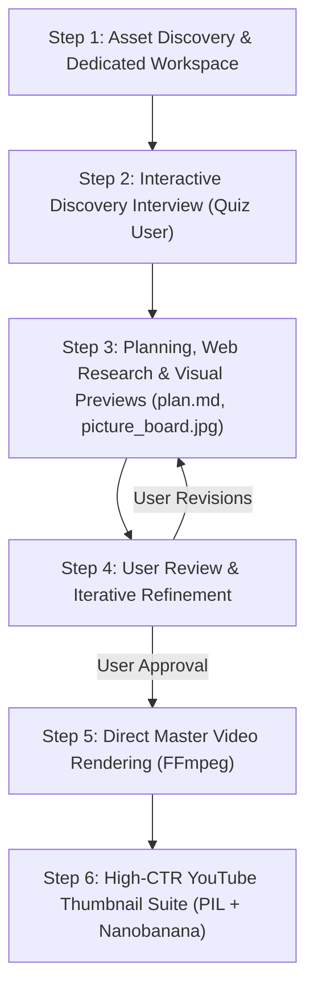

# 🎬 video-editor: Autonomous Video Editing Skill for AI Agents

[](https://opensource.org/licenses/MIT)
[](https://www.python.org/downloads/)
[](https://ffmpeg.org/)
[](https://deepmind.google/technologies/antigravity/)

An autonomous and interactive video editing skill designed for **Google Antigravity** and modern AI coding assistants. It guides users through an end-to-end editorial pipeline—discovering raw footage, conducting creative discovery interviews, calculating cut ratios, researching trivia via web search, de-slopping subtitles, building visual contact sheets, rendering master MP4s via FFmpeg, and crafting high-CTR YouTube thumbnails.

---

## 🌟 Key Capabilities

- **🚀 Direct FFmpeg Master Rendering:** No desktop GUI or `.osp` project compilation needed. Renders Full HD/4K masters directly with broadcast-grade EBU R128 audio normalization (-16 LUFS) and smooth alpha-fading typography.
- **🔍 Web-Researched Trivia:** Proactively executes web searches (`search_web`) to uncover historical context, ticket pricing, transit instructions, and cultural facts for video overlays.
- **✍️ Anti-Slop Subtitle Standards:** Applies strict `no-ai-slop` principles—bans corporate AI buzzwords (*"nestled"*, *"tapestry"*, *"bustling oasis"*) and camera meta-jargon (*"protagonist"*, *"our hero"*), ensuring punchy, human-sounding travel narration.
- **🖼️ Visual Picture Boards & Storyboards:** Automatically generates sequentially numbered keyframe cards (`picture_board.jpg`, `storyboard.jpg`) and a structured production plan (`plan.md`) for user approval before rendering.
- **🎨 Dynamic High-Contrast Typography:** Alternating Thai Gold (`#FFD700`), Electric Cyan (`#00E5FF`), Amber (`#FFA500`), and Crisp White (`#FFFFFF`) with 4-6px black strokes, translucent backing boxes, and smooth 1.2s alpha fade transitions.
- **🎯 High-CTR YouTube Thumbnails:** Combines authentic protagonist zoom (retaining real facial features from footage), shock factors (exotic street foods, landmarks), and high-contrast typography with optional Nanobanana AI styling.

---

## 🔄 The 6-Step Workflow



| Step | Action | Output / Deliverable |
| :--- | :--- | :--- |
| **1. Workspace Setup** | Scans raw video/photos; initializes project folder | `D:\gemini\<project>\renders\`, `storyboards\`, `thumbnails\` |
| **2. Discovery Interview** | Quizzes user on topic, target duration, platform (16:9 vs 9:16) | Creative brief parameters |
| **3. Planning & Previews** | Uncut runtime calculation, web research, visual keyframe extraction | `plan.md`, `picture_board.jpg`, `storyboard.jpg` |
| **4. Human-in-the-Loop** | Iterative review and refinement with user | User-approved production plan |
| **5. Master Rendering** | Automated FFmpeg pipeline: color grade, EBU R128 audio, subtitles | `master_vlog_1080p.mp4`, `renders_contact_sheet.jpg` |
| **6. Thumbnail Suite** | Authentic character zoom, shock factor badges, curiosity typography | 3–4 16:9 YouTube thumbnail variations (`.jpg`) |

---

## 🛠️ System Requirements & Installation

### Prerequisites
1. **Python 3.10+**
2. **FFmpeg & FFprobe:** Must be installed and accessible in your system `PATH`.
   - *Windows:* `winget install Gyan.FFmpeg` or download from [ffmpeg.org](https://ffmpeg.org).
   - *macOS:* `brew install ffmpeg`
   - *Linux:* `sudo apt update && sudo apt install ffmpeg`

### Install Dependencies
```bash
pip install -r requirements.txt
```

### Install into Antigravity

Clone this skill directly into your project's agent skills directory:
```bash
# Workspace-specific install:
cd <your-project-root>
git clone https://github.com/dev13-31/skill-video-editor.git .agents/skills/video-editor

# Global Antigravity install:
git clone https://github.com/dev13-31/skill-video-editor.git ~/.gemini/antigravity-cli/skills/video-editor
```

---

## 📁 Repository Structure

```text
video-editor/
├── SKILL.md                 # Agent skill instructions & YAML frontmatter
├── README.md                # Repository documentation
├── read-me.txt              # Plaintext summary
├── LICENSE                  # MIT open-source license
├── requirements.txt         # Python package dependencies
├── .gitignore               # Ignored cache, temp files, and media
├── scripts/                 # Core Python processing utilities
│   ├── contact_sheet.py     # Visual contact sheet & picture board generator
│   ├── quality_analyzer.py  # Blur/focus, static scene & uncut runtime analyzer
│   └── audio_processor.py   # EBU R128 audio normalization & voiceover alignment
└── references/              # Technical reference guides
    └── ffmpeg_recipes.md    # Production-tested FFmpeg filtergraph recipes
```

---

## 📄 License

This project is licensed under the **MIT License** - see the [LICENSE](LICENSE) file for details.
