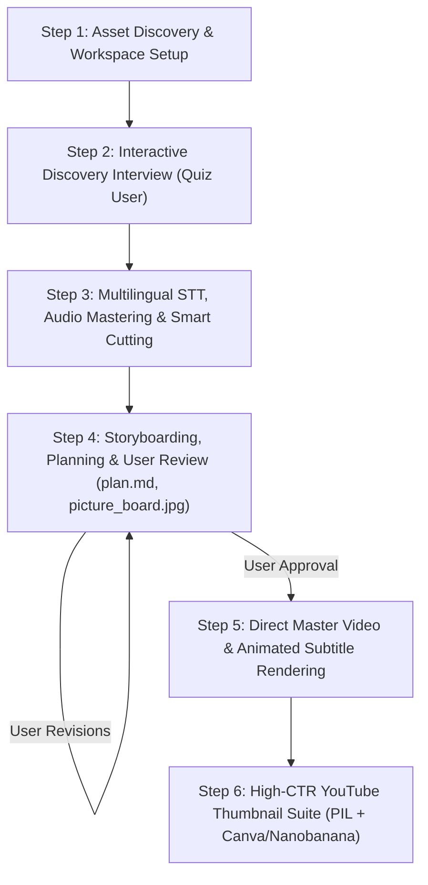

# 🎬 video-editor: Autonomous Video Editing Skill for AI Agents

[](https://opensource.org/licenses/MIT)
[](https://www.python.org/downloads/)
[](https://ffmpeg.org/)
[](https://github.com/SYSTRAN/faster-whisper)
[](https://deepmind.google/technologies/antigravity/)

An autonomous and interactive video editing skill designed for **Google Antigravity** and modern AI coding assistants. It guides users through an end-to-end editorial pipeline—discovering raw footage, conducting creative discovery interviews, transcribing multilingual speech with word-level precision, auto-cutting dead air silence, generating word-synchronized animated subtitles, mastering broadcast audio (-16 LUFS), rendering master MP4s directly via FFmpeg, and crafting high-CTR YouTube thumbnails.

---

## 🌟 Key Capabilities

- **🚀 Direct FFmpeg Master Rendering:** No desktop GUI or `.osp` project compilation needed. Renders Full HD/4K masters directly with broadcast-grade audio mastering and burned animated typography.
- **🎙️ Multilingual Speech-to-Text (`faster-whisper`):** Automatically detects and transcribes speech across English, Hindi, Bengali, Spanish, French, etc., extracting exact word-level timestamps (`start`, `end`, `word`).
- **✂️ Smart Silence & Stumble Auto-Cutter:** Automatically detects dead air and awkward pauses using FFmpeg `silencedetect`, preserving natural safety buffers (120ms) around speech for seamless jump cuts.
- **✨ Viral Animated Subtitles (.ass):** Generates high-retention word-pop highlighting and karaoke sweep animations synchronized with spoken words. Features native Windows `Nirmala UI` font and HarfBuzz complex shaping (`shaping=1:charenc=UTF-8`) for Hindi and Indic scripts.
- **🔊 6-Stage Broadcast Audio Mastering:** Eliminates low rumble (80Hz highpass), cuts ultrasonic hiss (12kHz lowpass), suppresses background noise with adaptive FFT (`afftdn`), boosts vocal clarity (2.5kHz EQ), levels dynamics (`dynaudnorm`), and enforces EBU R128 loudness standards (-16 LUFS).
- **🖼️ Visual Picture Boards & Storyboards:** Automatically generates sequentially numbered keyframe cards (`picture_board.jpg`, `storyboard.jpg`) and a structured production plan (`plan.md`) for user approval before rendering.
- **🎯 High-CTR YouTube Thumbnails:** Combines authentic protagonist zoom (retaining real facial features from footage), shock factors (exotic street foods, landmarks), and high-contrast typography with Canva and Nanobanana support.

---

## 🔄 The 6-Step Workflow


```mermaid
flowchart TD
    S1["Step 1: Asset Discovery & Workspace Setup"] --> S2["Step 2: Interactive Discovery Interview (Quiz User)"]
    S2 --> S3["Step 3: Multilingual STT, Audio Mastering & Smart Cutting"]
    S3 --> S4["Step 4: Storyboarding, Planning & User Review (plan.md, picture_board.jpg)"]
    S4 -->|User Revisions| S4
    S4 -->|User Approval| S5["Step 5: Direct Master Video & Animated Subtitle Rendering"]
    S5 --> S6["Step 6: High-CTR YouTube Thumbnail Suite (PIL + Canva/Nanobanana)"]
```

| Step | Action | Output / Deliverable |
| :--- | :--- | :--- |
| **1. Asset Discovery** | Scans raw video/photos; initializes project workspace | `D:\gemini\<project>\renders\`, `subtitles\`, `thumbnails\` |
| **2. Discovery Interview** | Quizzes user on topic, dialogue languages, cut style, and duration | Creative brief parameters |
| **3. STT, Audio & Cutting** | Multilingual transcription, silence jump-cutting, 6-stage audio mastering | Transcripts (JSON/SRT/VTT/ASS), jump-cut video, mastered audio |
| **4. Storyboard & Plan** | Sequentially numbered picture boards and structured production plan | `plan.md`, `picture_board.jpg`, `storyboard.jpg` |
| **5. Master Rendering** | Burns animated `.ass` subtitles, applies transitions, and renders MP4 | `final_master_subtitled.mp4`, `renders_contact_sheet.jpg` |
| **6. Thumbnail Suite** | Authentic character zoom, shock factors, and Canva/Nanobanana styling | 3–4 16:9 YouTube thumbnail variations (`.jpg`) |

---

## 🔌 MCP Server Tools

The integrated MCP server (`mcp/server.py`) provides specialized tools for autonomous agents:

| MCP Tool | Description |
| :--- | :--- |
| `video_scan_assets` | Discovers and inspects video clips, photos, and audio files. |
| `video_extract_frame` | Extracts high-res frames at exact timestamps for analysis or thumbnails. |
| `video_generate_contact_sheet` | Builds visual contact sheets and sequentially numbered picture boards. |
| `video_analyze_quality` | Computes Laplacian blur/focus scores, static scene detection, and runtime. |
| `video_transcribe_audio` | Multilingual STT via `faster-whisper`, returns word timestamps and exports subtitles. |
| `video_generate_animated_subtitles` | Generates word-pop or karaoke `.ass` animated subtitle cards. |
| `video_burn_subtitles` | Burns animated `.ass` subtitles permanently into video using FFmpeg `libass`. |
| `video_auto_cut_silence` | Detects silence and generates jump-cut video edits with click-free audio. |
| `video_enhance_audio` | 6-stage audio cleaner (rumble filter, hiss filter, FFT denoise, presence EQ, loudness). |
| `video_normalize_audio` | Dynamic audio normalization and two-pass EBU R128 loudness mastering. |
| `video_align_voiceover` | Detects speech pauses and spaces out voiceover audio segments. |
| `video_build_openshot_project` | Compiles `.osp` manifest for desktop OpenShot projects. |
| `video_export_render` | Renders high-quality video exports via FFmpeg presets. |

---

## 🛠️ System Requirements & Installation

### Prerequisites
1. **Python 3.10+**
2. **FFmpeg & FFprobe:** Must be installed and accessible in your system `PATH`.
   - *Windows:* `winget install Gyan.FFmpeg` or download from [ffmpeg.org](https://ffmpeg.org).
   - *macOS:* `brew install ffmpeg`
   - *Linux:* `sudo apt update && sudo apt install ffmpeg`

### Install Dependencies
```bash
pip install -r requirements.txt
```

### Install into Antigravity

Clone this skill directly into your project's agent skills directory:
```bash
# Workspace-specific install:
cd <your-project-root>
git clone https://github.com/dev13-31/skill-video-editor.git .agents/skills/video-editor

# Global Antigravity install:
git clone https://github.com/dev13-31/skill-video-editor.git ~/.gemini/config/skills/video-editor
```

---

## 📁 Repository Structure

```text
video-editor/
├── SKILL.md                 # Agent skill instructions & YAML frontmatter
├── README.md                # Comprehensive documentation
├── read-me.txt              # Plaintext summary
├── LICENSE                  # MIT open-source license
├── requirements.txt         # Python package dependencies
├── .gitignore               # Ignored cache, temp files, and media
├── mcp/
│   └── server.py            # FastMCP server exposing 13 video editing tools
├── scripts/                 # Core Python processing engines
│   ├── speech_transcriber.py# Multilingual faster-whisper STT & animated ASS generator
│   ├── auto_cutter.py       # Smart silence detection & automated jump-cutter
│   ├── audio_processor.py   # 6-stage broadcast audio mastering & normalization
│   ├── contact_sheet.py     # Visual contact sheet & picture board generator
│   ├── quality_analyzer.py  # Blur/focus, static scene & uncut runtime analyzer
│   └── openshot_builder.py  # OpenShot .osp manifest compiler
└── references/              # Technical reference guides
    ├── ffmpeg_recipes.md    # Production-tested FFmpeg filtergraph recipes (12 categories)
    └── openshot_spec.md     # OpenShot project specification and keyframe curves
```

---

## 📄 License

This project is licensed under the **MIT License** - see the [LICENSE](LICENSE) file for details.
